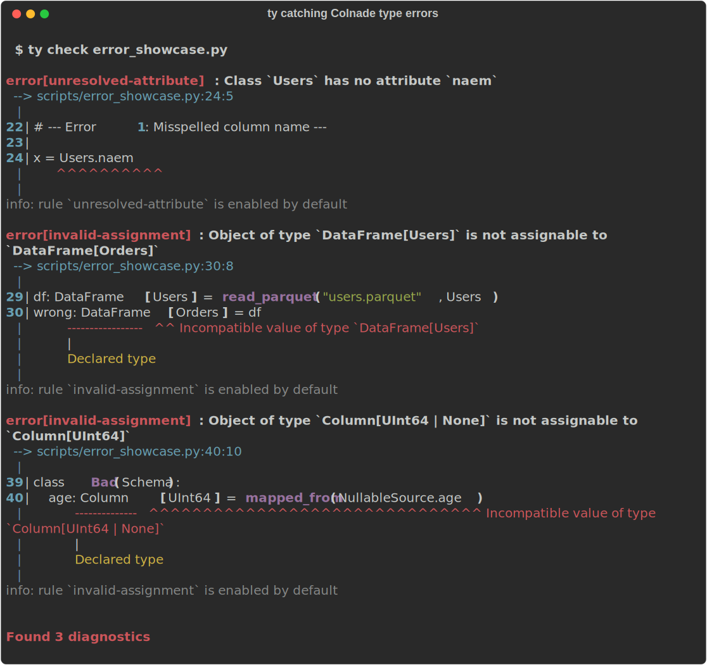

<p align="center">
  
</p>

<h1 align="center">Colnade</h1>

<p align="center">
  <a href="https://github.com/jwde/colnade/actions/workflows/ci.yml"></a>
  <a href="https://htmlpreview.github.io/?https://github.com/jwde/colnade/blob/python-coverage-comment-action-data/htmlcov/index.html"></a>
  <a href="https://pypi.org/project/colnade/"></a>
  <a href="https://pypi.org/project/colnade/"></a>
</p>

<p align="center">A statically type-safe DataFrame abstraction layer for Python.</p>

Colnade replaces string-based column references (`pl.col("age")`) with typed descriptors (`Users.age`), so column misspellings, type mismatches, and schema violations are caught by your type checker — before your code runs.

Works with [ty](https://github.com/astral-sh/ty), mypy, and pyright. No plugins, no code generation.

## Installation

```bash
pip install colnade colnade-polars
```

Colnade requires Python 3.10+. Install the backend adapter for your engine:

| Backend | Install |
|---------|---------|
| Polars | `pip install colnade-polars` |
| Pandas | `pip install colnade-pandas` |
| Dask | `pip install colnade-dask` |

## Quick Start

### 1. Define a schema

```python
from colnade import Column, Schema, UInt64, Float64, Utf8

class Users(Schema):
    id: Column[UInt64]
    name: Column[Utf8]
    age: Column[UInt64]
    score: Column[Float64]
```

### 2. Create or read typed data

```python
from colnade_polars import from_rows, read_parquet

# From Python data — schema drives dtype coercion
df = from_rows(Users, [
    Users.Row(id=1, name="Alice", age=30, score=85.0),
    Users.Row(id=2, name="Bob", age=25, score=92.5),
])

# Or from files
df = read_parquet("users.parquet", Users)
# df is DataFrame[Users] — the type checker knows the schema
```

### 3. Transform with full type safety

```python
# Column references are attributes, not strings
result = (
    df.filter(Users.age > 25)
      .sort(Users.score.desc())
      .select(Users.name, Users.score)
)
```

### 4. Bind to an output schema

```python
class UserSummary(Schema):
    name: Column[Utf8]
    score: Column[Float64]

output = result.cast_schema(UserSummary)
# output is DataFrame[UserSummary]
```

## Safety Model

Colnade catches errors at three levels:

1. **In your editor** — misspelled columns, schema mismatches at function boundaries, and nullability violations are flagged by your type checker (`ty`, `pyright`, `mypy`) before code runs
2. **At data boundaries** — runtime validation ensures files and external data match your schemas (columns, types, nullability) and that expressions reference columns from the correct schema
3. **On your data values** — `Field()` constraints validate domain invariants like ranges, patterns, and uniqueness

**Where static safety ends:** Static checking covers column references and schema-preserving operations (`filter`, `sort`, `with_columns`). Schema-transforming operations (`select`, `group_by`) return `DataFrame[Any]` — `cast_schema()` re-binds to a named schema and is a runtime trust boundary. No type checker plugin is needed, but this is a deliberate tradeoff: plugins could theoretically infer output schemas at the cost of type-checker coupling and maintenance burden. See [Type Checker Integration](https://colnade.com/user-guide/type-checking/) for the full list of what is and isn't checked.

## Key Features

### Type-safe column references

Column references are class attributes verified by the type checker at lint time:

```python
Users.name   # Column[Utf8] — valid
Users.naem   # ty error: Class `Users` has no attribute `naem`
```

### Schema-preserving operations

Operations that don't change the schema (filter, sort, limit, with_columns) preserve the type parameter:

```python
def process(df: DataFrame[Users]) -> DataFrame[Users]:
    return df.filter(Users.age > 25).sort(Users.score.desc())
```

### Typed expressions

Column descriptors build an expression tree with typed operators:

```python
Users.age > 18          # Expr[Bool] — comparison
Users.score * 2         # Expr[Float64] — arithmetic
(Users.age > 18) & (Users.score > 80)  # Expr[Bool] — logical
Users.name.str_starts_with("A")        # Expr[Bool] — string method
```

### Aggregations

```python
result = df.group_by(Users.name).agg(
    Users.score.mean().alias(UserStats.avg_score),
    Users.id.count().alias(UserStats.user_count),
)
```

### Null handling

```python
# Fill nulls, filter nulls, check nulls
df.with_columns(Users.score.fill_null(0.0).alias(Users.score))
df.filter(Users.score.is_not_null())
df.drop_nulls(Users.score)
```

### Joins with typed output

```python
joined = users.join(orders, on=Users.id == Orders.user_id)
# JoinedDataFrame[Users, Orders] — both schemas accessible

class UserOrders(Schema):
    user_name: Column[Utf8] = mapped_from(Users.name)
    amount: Column[Float64]

result = joined.cast_schema(UserOrders)
```

### Schema-polymorphic utility functions

Write generic functions that work with any schema:

```python
from colnade.schema import S

def first_n(df: DataFrame[S], n: int) -> DataFrame[S]:
    return df.head(n)

# Works with any schema — type preserved
users_subset: DataFrame[Users] = first_n(users_df, 10)
```

### Struct and List support

```python
class Address(Schema):
    city: Column[Utf8]
    zip_code: Column[Utf8]

class UserProfile(Schema):
    name: Column[Utf8]
    address: Column[Struct[Address]]
    tags: Column[List[Utf8]]

# Access nested data
df.filter(UserProfile.address.field(Address.city) == "New York")
df.with_columns(UserProfile.tags.list.len().alias(UserProfile.tags))
```

### Value-level constraints

```python
from colnade import Column, Schema, UInt64, Utf8, Float64, ValidationLevel
from colnade.constraints import Field, schema_check

class Users(Schema):
    id: Column[UInt64] = Field(unique=True)
    age: Column[UInt64] = Field(ge=0, le=150)
    email: Column[Utf8] = Field(pattern=r"^[^@]+@[^@]+\.[^@]+$")
    status: Column[Utf8] = Field(isin=["active", "inactive"])

    @schema_check
    def adult(cls):
        return Users.age >= 18

# Validate with df.validate() or auto-validate at the FULL level
from colnade import set_validation
set_validation(ValidationLevel.FULL)
```

### Lazy execution

```python
from colnade_polars import scan_parquet

lazy = scan_parquet("users.parquet", Users)
# LazyFrame[Users] — builds a query plan

result = lazy.filter(Users.age > 25).sort(Users.score.desc()).collect()
# Executes the optimized query plan
```

### Untyped escape hatch

When you need to drop down to untyped operations:

```python
untyped = df.untyped()  # UntypedDataFrame — string-based columns
retyped = untyped.to_typed(Users)  # Back to DataFrame[Users]
```

## Performance

Colnade adds < 5% overhead for typical Polars operations and < 5% for single Pandas operations (10–25% for multi-step Pandas pipelines at large sizes). Dask overhead is a fixed ~200–300 us per operation on graph construction, negligible compared to compute time. Validation (STRUCTURAL, FULL) adds measurable cost at data boundaries — see the full [benchmark results](https://colnade.com/user-guide/performance/) for details.

## Type Checker Error Showcase

Colnade catches real errors at lint time. Here are actual error messages from `ty`:

<p align="center">
  
</p>

## Comparison with Existing Solutions

| Feature | Colnade | Pandera | StaticFrame | Patito | Narwhals |
|---------|---------|---------|-------------|--------|----------|
| Column refs checked statically | Named attrs | No | Positional types | No | No |
| Schema preserved through ops | Through ops¹ | At boundaries² | No | No | No |
| Works with existing engines | Polars, Pandas, Dask | Pandas, Polars, others | Own engine | Polars only | Many engines |
| No plugins or code gen | Yes | Optional mypy plugin | Yes | Yes | Yes |
| Generic utility functions | Yes | No | No | No | No |
| Struct/List typed access | Yes | No | No | No | No |
| Lazy execution support | Yes | No | No | No | Yes |
| Value-level constraints | `Field()` | `Check` | No | Pydantic validators | No |
| Maturity / ecosystem | New (v0.6) | Mature, large community | Mature | Small | Growing fast |
| Engine breadth | 3 backends | 4+ backends | Own engine | 1 backend | 6+ backends |
| select/group_by output typing | `DataFrame[Any]`³ | Decorator-checked | Positional types | No | No |

¹ Schema-preserving ops (filter, sort, with_columns) retain `DataFrame[S]`. Schema-transforming ops (select, group_by) return `DataFrame[Any]` — use `cast_schema()` to bind.
² Pandera's `@check_types` validates schemas at function boundaries via decorator, but column references within function bodies remain unchecked strings.
³ `cast_schema()` re-binds at runtime. A type checker plugin could theoretically infer output schemas, but Colnade intentionally avoids plugin coupling.

See [Detailed Comparisons](https://colnade.com/comparison/) for a fuller discussion of tradeoffs.

## Documentation

Full documentation is available at [colnade.com](https://colnade.com/), including:

- [Getting Started](https://colnade.com/getting-started/installation/) — installation and quick start
- [User Guide](https://colnade.com/user-guide/core-concepts/) — concepts, schemas, expressions, joins
- [Tutorials](https://colnade.com/tutorials/basic-usage/) — worked examples with real data
- [API Reference](https://colnade.com/api/) — auto-generated from source

## Examples

Runnable examples are in the [`examples/`](examples/) directory:

- [`basic_usage.py`](examples/basic_usage.py) — Schema definition, filter, select, aggregate
- [`null_handling.py`](examples/null_handling.py) — Nullable columns, fill_null, drop_nulls
- [`joins.py`](examples/joins.py) — Joining DataFrames, JoinedDataFrame, cast_schema
- [`generic_functions.py`](examples/generic_functions.py) — Schema-polymorphic utility functions
- [`nested_types.py`](examples/nested_types.py) — Struct and List column operations
- [`full_pipeline.py`](examples/full_pipeline.py) — Complete ETL pipeline example

## License

MIT
