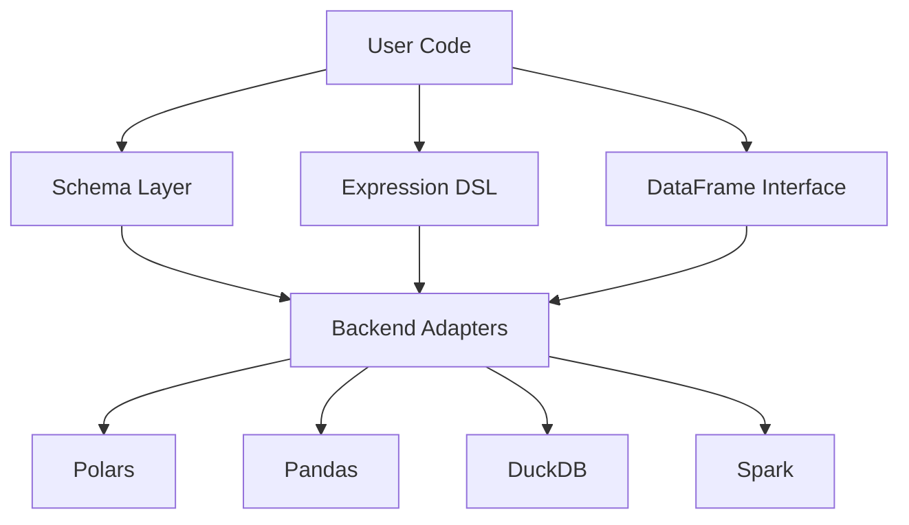

# Core Concepts

Colnade is organized into four layers. Understanding these layers helps you use the library effectively.

## Architecture



## Schema Layer

Schemas define the structure of your data. They are Python classes that extend `Schema`:

```python
class Users(Schema):
    id: Column[UInt64]
    name: Column[Utf8]
    age: Column[UInt64]
```

The metaclass (`SchemaMeta`) converts each `Column[DType]` annotation into a descriptor object. `Users.age` is a `Column[UInt64]` instance — not a string, not an integer. The type checker can verify attribute access.

Schemas support inheritance, trait composition, and the `mapped_from` helper for schema transitions. See [Schemas](schemas.md) for details.

## Expression DSL

When you write `Users.age > 18`, you get an expression tree node — specifically a `BinOp[Bool]`. The expression is not evaluated immediately. Instead, it builds an abstract syntax tree (AST) that a backend adapter translates into engine-native code.

Key expression types:

- **Comparisons**: `Users.age > 18` → `BinOp[Bool]`
- **Arithmetic**: `Users.score * 2` → `BinOp[Float64]`
- **Aggregations**: `Users.score.mean()` → `Agg[Float64]`
- **String methods**: `Users.name.str_starts_with("A")` → `FunctionCall[Bool]`
- **Null checks**: `Users.age.is_null()` → `UnaryOp[Bool]`

See [Expressions](expressions.md) for the full DSL reference.

## DataFrame Layer

`DataFrame[S]` is a typed container parameterized by a schema. Operations are divided into two categories:

**Schema-preserving** — return `DataFrame[S]` (same schema):
`filter`, `sort`, `limit`, `head`, `tail`, `sample`, `unique`, `drop_nulls`, `with_columns`

**Schema-transforming** — return `DataFrame[Any]` (schema changes):
`select`, `group_by().agg()`

After a schema-transforming operation, use `cast_schema()` to bind to a new named schema. See [DataFrames](dataframes.md) for details.

## Backend Adapters

Backends translate expression trees and execute operations. The core library defines a `BackendProtocol`; each adapter implements it for a specific engine.

Currently available: **`colnade-polars`** (Polars backend)

When you call `read_parquet("data.parquet", Users)`, the Polars backend is automatically attached. All subsequent operations on the DataFrame delegate to Polars under the hood.

## The Type Safety Model

Colnade provides compile-time safety at three levels:

1. **Column references** — `Users.naem` is a type error (attribute doesn't exist)
2. **Schema boundaries** — `DataFrame[Users]` cannot be passed where `DataFrame[Orders]` is expected
3. **Nullability** — `mapped_from` a nullable column to a non-nullable annotation is a type error

Operations within function bodies (e.g., using `Orders.amount` on a `DataFrame[Users]`) produce correct expression types but cannot be statically checked for schema membership — this is a known limitation documented in [Type Checker Integration](type-checking.md).
