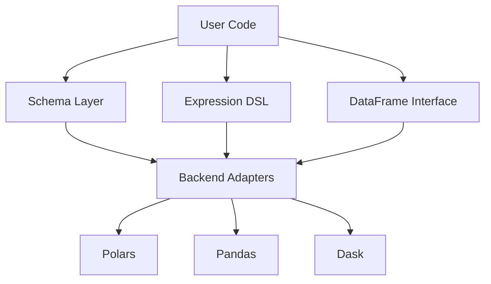

# Core Concepts

Colnade is organized into four layers. Understanding these layers helps you use the library effectively.

## Architecture



## Schema Layer

Schemas define the structure of your data. They are Python classes that extend `Schema`:

```python
import colnade as cn

class Users(cn.Schema):
    id: cn.Column[cn.UInt64]
    name: cn.Column[cn.Utf8]
    age: cn.Column[cn.UInt64]
```

The metaclass (`SchemaMeta`) converts each `Column[DType]` annotation into a descriptor object. `Users.age` is a `Column[UInt64]` instance — not a string, not an integer. The type checker can verify attribute access.

Schemas support inheritance, trait composition, and the `mapped_from` helper for schema transitions. See [Schemas](schemas.md) for details.

## Expression DSL

When you write `Users.age > 18`, you get an expression tree node — specifically a `BinOp[Bool]`. The expression is not evaluated immediately. Instead, it builds an abstract syntax tree (AST) that a backend adapter translates into engine-native code.

Key expression types:

- **Comparisons**: `Users.age > 18` → `BinOp[Bool]`
- **Arithmetic**: `Users.score * 2` → `BinOp[Float64]`
- **Aggregations**: `Users.score.mean()` → `Agg[Float64]`
- **String methods**: `Users.name.str_starts_with("A")` → `FunctionCall[Bool]`
- **Null checks**: `Users.age.is_null()` → `UnaryOp[Bool]`

See [Expressions](expressions.md) for the full DSL reference.

## DataFrame Layer

`DataFrame[S]` is a typed container parameterized by a schema. Operations are divided into two categories:

**Schema-preserving** — return `DataFrame[S]` (same schema):
`filter`, `sort`, `limit`, `head`, `tail`, `sample`, `unique`, `drop_nulls`, `with_columns`

**Schema-transforming** — return `DataFrame[Any]` (schema changes):
`select`, `group_by().agg()`

After a schema-transforming operation, use `cast_schema()` to bind to a new named schema. See [DataFrames](dataframes.md) for details.

## Backend Adapters

Backends translate expression trees and execute operations. The core library defines a `BackendProtocol`; each adapter implements it for a specific engine.

Available adapters:

- **`colnade-polars`** — Polars backend (eager + lazy)
- **`colnade-pandas`** — Pandas backend (eager)
- **`colnade-dask`** — Dask backend (lazy, distributed)

When you call `read_parquet("data.parquet", Users)`, the backend is automatically attached. All subsequent operations on the DataFrame delegate to the underlying engine.

## The Safety Model

Colnade catches errors at three levels:

### 1. In your editor (static analysis)

Your type checker (`ty`, `pyright`, `mypy`) catches errors before code runs:

- **Column references** — `Users.naem` is a type error (attribute doesn't exist)
- **Schema boundaries** — `DataFrame[Users]` cannot be passed where `DataFrame[Orders]` is expected
- **Nullability** — `mapped_from` a nullable column to a non-nullable annotation is a type error

Operations within function bodies (e.g., using `Orders.amount` on a `DataFrame[Users]`) produce correct expression types but cannot be statically checked for schema membership. When validation is enabled, these are caught at runtime instead — see [Type Checker Integration](type-checking.md) for details.

`cast_schema()` is the primary trust boundary: the type checker verifies input expressions, but the developer asserts the output conforms. Use `mapped_from` on output schema fields and `extra="forbid"` to narrow the gap. See [DataFrames: cast_schema](dataframes.md#cast_schema-is-a-trust-boundary) for details.

### 2. At data boundaries (runtime structural validation)

When validation is enabled, data boundaries (`read_parquet`, `from_batches`, `cast_schema`) verify that actual data matches your schema:

- **Missing columns** — columns required by the schema but absent in the data
- **Type mismatches** — actual dtypes don't match expected dtypes
- **Null violations** — non-nullable columns containing null values
- **Expression column membership** — operations like `filter`, `sort`, `select` verify that all column references in expressions belong to the frame's schema (e.g., using `Orders.amount` on a `DataFrame[Users]` raises `SchemaError`)

Enable with `cn.set_validation(cn.ValidationLevel.STRUCTURAL)` or `COLNADE_VALIDATE=structural`. See [DataFrames: Validation](dataframes.md#validation) for details.

### 3. On your data values

Value-level constraints validate domain invariants using `Field()` metadata:

```python
class Users(cn.Schema):
    id: cn.Column[cn.UInt64] = cn.Field(unique=True)
    age: cn.Column[cn.UInt64] = cn.Field(ge=0, le=150)
    email: cn.Column[cn.Utf8] = cn.Field(pattern=r"^[^@]+@[^@]+\.[^@]+$")
    status: cn.Column[cn.Utf8] = cn.Field(isin=["active", "inactive"])
```

Checked by `df.validate()` (always) and by auto-validation at the `FULL` level. See [DataFrames: Value-level constraints](dataframes.md#level-3-on-your-data-values-value-level-constraints) for the full constraint reference.
