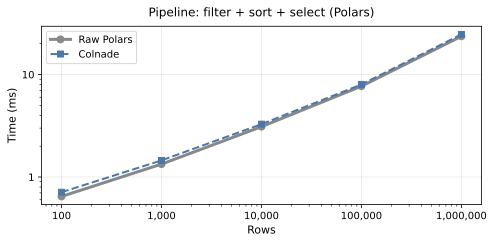

# Performance

Colnade's expression DSL builds an AST (abstract syntax tree) that gets translated to engine-native operations. This page shows the overhead of that abstraction layer across all three backends and the cost of enabling validation.

## Key takeaways

- **Overhead is O(1) per operation** — Colnade adds a fixed ~50–100 us to translate the expression AST into engine-native calls. This cost does not grow with dataset size.
- **Polars and Pandas**: Overhead is indistinguishable from zero for all tested sizes (100 to 1M rows). Individual operations and multi-step pipelines both measure within the noise floor.
- **Dask** (graph construction): ~200–300 us added per operation. This is a fixed cost that's dwarfed by actual `.compute()` time.
- **Validation is not free**, but it's designed for development and CI, not production hot paths.

<p align="center">
  
</p>

## Abstraction overhead by backend

All benchmarks compare Colnade-typed operations against equivalent raw backend calls. Times are in microseconds (us). Validation is disabled.

### Polars

| Operation | Rows | Raw (us) | Colnade (us) | Overhead |
|-----------|------|----------|--------------|----------|
| filter | 100 | 280 | 280 | ~0% |
| filter | 10K | 280 | 280 | ~0% |
| filter | 1M | 3,000 | 2,500 | ~0% |
| select | 100 | 120 | 130 | ~0% |
| select | 10K | 120 | 110 | ~0% |
| select | 1M | 190 | 140 | ~0% |
| pipeline | 100 | 650 | 650 | ~0% |
| pipeline | 10K | 3,000 | 3,200 | ~0% |
| pipeline | 1M | 28,000 | 24,000 | ~0% |

Pipeline = filter + sort + select.

Polars overhead is in the noise — both Colnade and raw Polars produce identical `pl.Expr` objects. The only extra cost is walking the AST to build them.

### Pandas

| Operation | Rows | Raw (us) | Colnade (us) | Overhead |
|-----------|------|----------|--------------|----------|
| filter | 100 | 160 | 160 | ~0% |
| filter | 10K | 300 | 280 | ~0% |
| filter | 1M | 31,000 | 30,000 | ~0% |
| select | 100 | 110 | 110 | ~0% |
| select | 10K | 250 | 160 | ~0% |
| select | 1M | 20,000 | 19,000 | ~0% |
| pipeline | 100 | 420 | 500 | ~0% |
| pipeline | 10K | 1,000 | 1,050 | ~0% |
| pipeline | 1M | 184,000 | 185,000 | ~0% |

Raw Pandas operations include `.reset_index(drop=True)` at each step to match Colnade's behavior (fair apples-to-apples comparison).

Colnade's Pandas adapter resets the DataFrame index after each operation to maintain consistent positional indexing. The overhead of expression AST translation (~50–100 us per step) is unmeasurable against the cost of the Pandas operation itself.

### Dask (lazy graph construction)

| Operation | Rows | Raw (us) | Colnade (us) | Overhead |
|-----------|------|----------|--------------|----------|
| filter | 100 | 200 | 390 | +200 us |
| filter | 10K | 210 | 420 | +210 us |
| filter | 1M | 260 | 470 | +210 us |
| select | 100 | 150 | 150 | ~0 us |
| select | 10K | 170 | 150 | ~0 us |
| select | 1M | 160 | 170 | ~0 us |
| pipeline | 100 | 450 | 720 | +270 us |
| pipeline | 10K | 450 | 740 | +290 us |
| pipeline | 1M | 440 | 780 | +340 us |

Dask operations are lazy — these benchmarks measure **graph construction**, not execution. The overhead is a fixed ~200–300 us from building callables via `translate_expr()`. Since actual Dask `.compute()` time ranges from milliseconds to minutes, this overhead is negligible in practice.

Note: Dask graph construction time does not scale with row count — only the number of partitions and expression complexity matter.

## Validation overhead

Validation runs at data boundaries (I/O, `validate()` calls). The table below shows absolute times for each validation level, measured by calling `validate_schema()` and `validate_field_constraints()` directly.

### By level and backend

| Backend | Rows | OFF (us) | STRUCTURAL (us) | FULL (us) |
|---------|------|----------|------------------|-----------|
| Polars | 100 | ~0 | 11 | 175 |
| Polars | 10K | ~0 | 15 | 430 |
| Polars | 1M | ~0 | 20 | 52,000 |
| Pandas | 100 | ~0 | 75 | 720 |
| Pandas | 10K | ~0 | 420 | 2,200 |
| Pandas | 1M | ~0 | 18,000 | 148,000 |
| Dask | 100 | ~0 | 16,000 | 20,000 |
| Dask | 10K | ~0 | 17,500 | 22,000 |
| Dask | 1M | ~0 | 560,000 | 750,000 |

The FULL schema uses `Field(unique=True, ge=..., le=..., min_length=..., max_length=...)` on all four columns.

### What the numbers mean

**OFF** (default) — Zero validation overhead. The DataFrame constructor is a simple object allocation. This is the recommended setting for production.

**STRUCTURAL** — Checks that columns exist, dtypes match, and non-nullable columns have no nulls.

- **Polars**: ~10–20 us regardless of size. Polars tracks null counts in column metadata, so the null check is O(columns), not O(rows).
- **Pandas**: 75 us (100 rows) → 18 ms (1M rows). Pandas must scan each column to detect nulls, so cost scales linearly with rows.
- **Dask**: 16–560 ms. Requires materializing the lazy DataFrame via `.compute()` before checking. The cost is dominated by Dask's compute overhead at small sizes and by row scanning at large sizes.

**FULL** — Structural checks plus value-level constraint checking from `Field()`.

- Each `Field()` constraint scans the relevant column once (e.g., `ge=0` checks `series < 0`).
- `unique=True` is the most expensive constraint — it requires sorting or hashing the column.
- Cost scales linearly with rows × number of constrained columns.
- At 1M rows with 4 constrained columns, FULL adds ~50 ms (Polars) to ~150 ms (Pandas).

### Recommendations

| Setting | Use case |
|---------|----------|
| `OFF` | Production, hot paths, large-scale batch processing |
| `STRUCTURAL` | CI pipelines, integration tests, development |
| `FULL` | Unit tests, data quality gates, ingest validation |

!!! tip
    Use the `COLNADE_VALIDATE` environment variable so you can enable validation in CI without changing code:
    ```bash
    COLNADE_VALIDATE=structural pytest tests/
    COLNADE_VALIDATE=full pytest tests/
    ```

## Why abstraction overhead is low

Colnade's overhead comes from two sources, both constant per operation:

1. **AST construction** — Building `BinOp(ColumnRef("age"), Literal(25), ">")` instead of `pl.col("age") > 25`. Both are pure Python object allocations — the difference is a few microseconds.

2. **AST translation** — Walking the expression tree and producing engine-native calls. For Polars this produces `pl.Expr` objects. For Pandas/Dask this produces callables.

Neither source grows with DataFrame size. As rows increase, the engine's execution time dominates and the abstraction cost disappears into measurement noise.

## Running benchmarks

```bash
# Polars-specific overhead (expression construction, filter, select, pipeline, lazy)
uv run python benchmarks/bench_overhead.py

# All three backends (Polars, Pandas, Dask)
uv run python benchmarks/bench_backends.py

# Validation overhead at each level
uv run python benchmarks/bench_validation.py
```

Results vary by hardware — the relative overhead percentages are more meaningful than absolute times.
